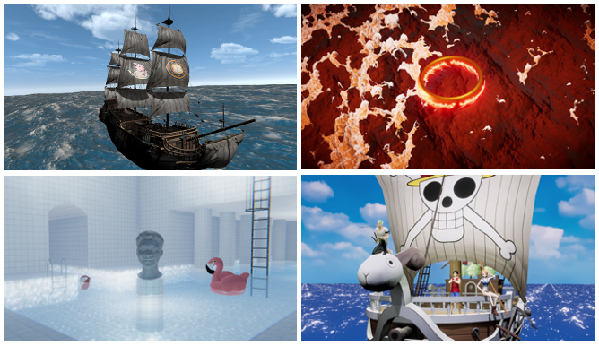
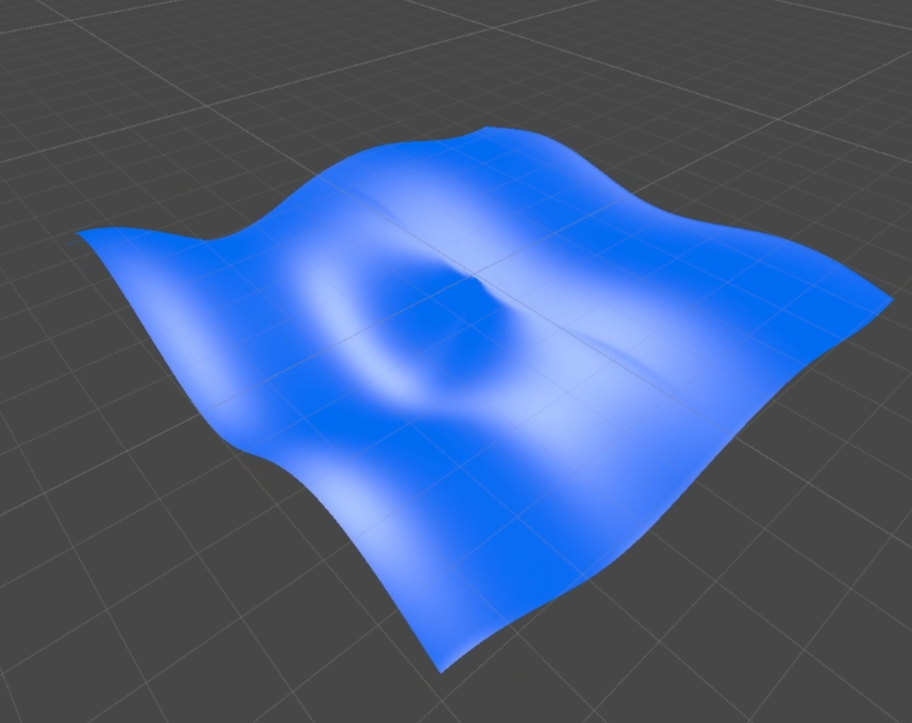
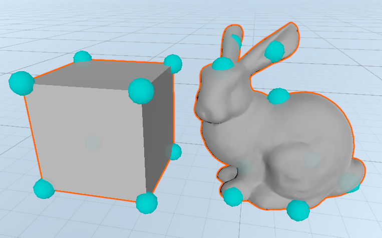
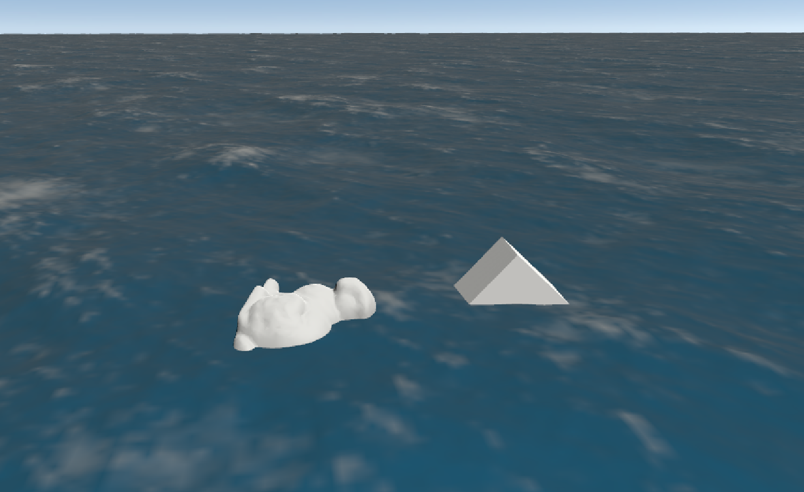
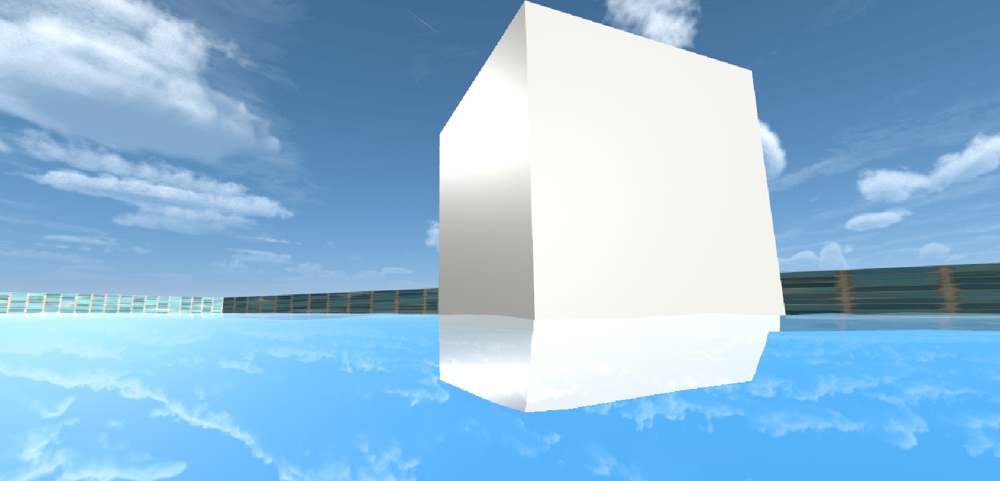
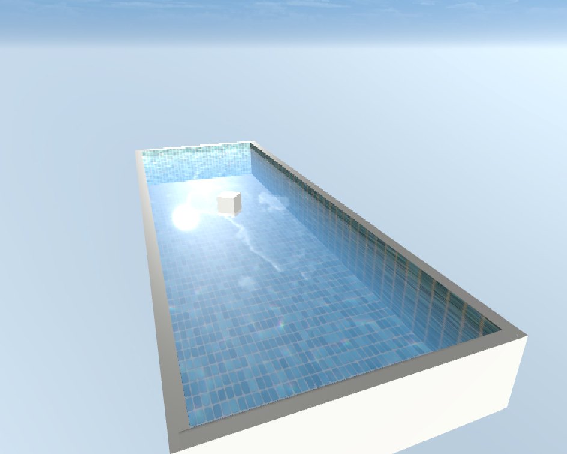
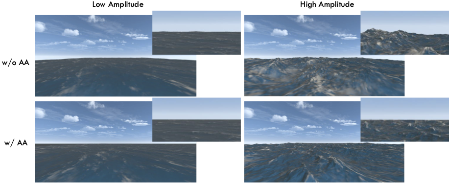
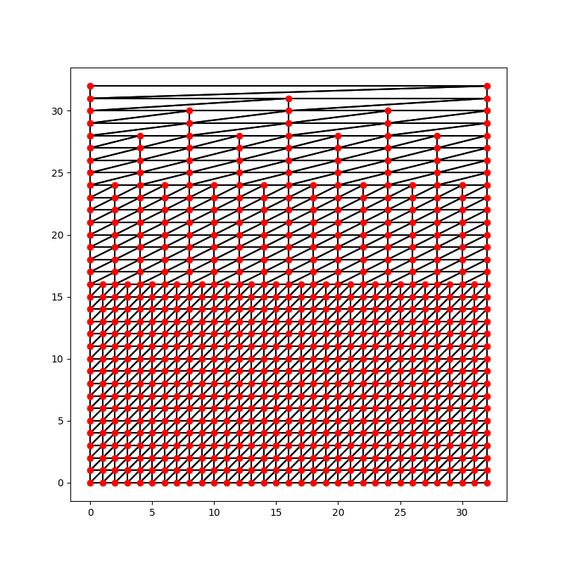



    
    
<em>Figure 1</em>. Our water model adapts to diverse fluid scenarios such as ocean waves, lava flows, pool ripples, and stylized seas using only simple parameter tweaks.

## Abstract

Creating a convincing water simulation has traditionally been a difficult task in computer graphics due to its complex behavior and demand for a potentially high level of detail in splashes, foam, and bubbles. This is an especially difficult problem since many applications such as video games demand this realistic effects to be computed and rendered at real-time frame rates. We present a heuristics-based water simulation using Unity that allows for a high level of visual fidelity while still performing at real-time rates. Our simulation contains many of the features that are widely desired, including a realistic surface geometry, realistic lighting effects, buoyancy for physics, and level of detail optimizations to make sure that our simulation can run in real-time and be anti-aliased. With this wide array of features, our model creates a visually appealing, real-time water simulation that is useful for a wide variety of applications. 

## Introduction

Water simulation is an important problem that has been extensively researched for tasks such as CGI film, video game design, and simulation environments. However, these effects can be very computationally expensive to physically model, so a number of heuristics have been created to circumvent more physically-grounded computations without losing visual fidelity. For cases such as video game design, making it real-time is crucial, and there is currently no standardized way of optimizing it (so different implementations use wildly different techniques based on artistic preference and requirements). We aim to produce a real-time water simulation that contains most of the features which will be widely wanted, including a realistic surface, caustics for visual effect, buoyancy for physics, destruction physics for gameplay, and level-of-detail optimization to make sure that it is still real-time and anti-aliased.

The simulation we present can be broken up into 3 main parts: mesh manipulation, lighting, and buoyancy. The water mesh is manipulated to follow a sum of sine waves with various frequency modifications in the frequency domain by using Fast Fourier Transform (FFT). To achieve real-time performance, the wave calculations have been parallelized by Unity compute shaders so the GPU can be utilized. Custom shaders were written to handle the realistic lighting of the water mesh. Buoyancy was implemented by devising a sampling strategy to approximate volume of an object under the water mesh and apply appropriate physics to push the object up.

## Phase 1 –– The Basics

In this phase, we implemented a basic working prototype of our water simulation from which we could add the more complex features in the next phase. This involved creating a water mesh which we manipulated using a sum of sine waves to create a convincing wave geometry, as well as some Blinn-Phong shading to give our mesh a simple lighting model with some physical realism.

### Water Mesh Creation

We generate a uniform grid mesh over the $x$–$z$ plane, form triangles for each cell, and recalculate normals. This consistent resolution can cause aliasing at a distance, which is addressed in Phase 2.

### Simple Sum of Sine Waves

We compute the GPU displacement map by summing two sine waves and scaling by wind. For UV coordinates $(u,v)\in[0,1]^2$ and time $t$, the height is
$$
d(u,v,t)
= \frac{A}{2}\bigl(\sin(\omega(u + t)) + \cos(\omega(v + t))\bigr)\bigl(w_0 + (w_1 - w_0)\max(0,\hat r\cdot\hat w)\bigr),
$$
where $A$ is the wave amplitude, $\omega$ the frequency, $\hat r$ the unit vector from the UV center to the sample point, $\hat w$ the wind direction, and $w_0,w_1$ set the wind‐scaling range. In theory, adding more sine waves increases fidelity, but this approach still can’t capture the full complexity of real fluid waves. In Phase 2, we address 

### Blinn-Phong Shading

For our initial setup, we implemented a simple Blinn-Phong shading model to provide a reasonably realistic lighting model for our simulation. Blinn-Phong shading approximates how light interacts with a surface by computing an ambient, specular, and diffuse component, to reasonably reproduce a variety of optical phenomena. However, this model is too simplistic to create a visually convincing water effect, as it fails to take into account effects such as reflections, refractions, caustics, and the fact that water is a participating medium. In Phase 2, we implement these additional lighting effects to make our simulation much more visually appealing.

    
    
<em>Figure 2</em>. Render for one frame of the phase 1 basic water simulation.

## Phase 2 –– Simplification and Extension of Open Source

Using Gunnell's open source water project as a blueprint and supporting code libraries [1,6], we implemented a simplified FFT‐based water system with single spectrum waves of 4 layers, basic lighting of the environment, a basic foam layer driven by height thresholds and no skybox sampling at runtime. To create a comprehensive water model, we improved three key areas: efficient buoyancy, enhanced lighting features (reflection, refraction, and caustics), and an MIP-mesh to eliminate aliasing at the horizon.

### Custom Float-Point Buoyancy System

Buoyancy is the upward force exerted on a submerged object, equal to the weight of the displaced fluid, as described by Archimedes' principle. A common baseline implementation constrains objects directly to the fluid height with damping. While efficient, this ignores wave dynamics and lateral forces derived from surface normals. At the other extreme, voxel-based methods approximate the object’s volume and iterate per-frame to determine submerged voxels for force integration. This provides higher fidelity but incurs significant computational cost. We adopt an intermediate approach: a custom Float-Point system that samples discrete points on the mesh surface to estimate buoyant forces. This method reasonably approximates buoyant behavior while maintaining computational efficiency suitable for real-time simulation with thousands objects.

The standard Archimedes' equation is:
$$
F_{arch} = \rho_f V_d g
$$

where $\rho_f$ is the fluid density, $V_d$ is the displaced volume, and $g$ is the gravitational acceleration.

For our model we approximate the displaced volume by sampling \( n \) hand placed discrete float-points on the object's surface:

$$
\mathbf{F}_{\text{total}} = \sum_{i=1}^{n} A_i (\rho g d_i) \mathbf{n}_i - c v_{y,i} \mathbf{u}
$$

where $A_i$ is the effective area at float-point $i$, $\rho$ is the fluid density, $g$ is gravitational acceleration, $d_i$ is the submerged depth at point $i$, $\mathbf{n}_i$ is the local fluid normal, $c$ is the damping coefficient, $v_{y,i}$ is the vertical velocity at point $i$, and $\mathbf{u}$ is the global up vector. Damping was introduced to promote stability and enable artistic control over the buoyant response. Effective area was introduced to weight floating points differently, since one point may represent a small region of the model while another covers a much larger area. Submerged depths and normals come from the GPU displacement map and feed Unity’s CPU-side Rigidbody physics. While this adds a small delay, caching the displacement map each frame makes the latency largely imperceptible.

    
    
<em>Figure 3</em>. Float-Points Placed on Objects.

Placing one buoyancy sample at every point in the mesh guarantees that the float‐point set fully represents the surface geometry, but the per‐frame cost of evaluating $\mathbf{F}_{\rm buoy}$ and $\mathbf{F}_{\rm damp}$ at each sample scales as
$$
T \;=\; \mathcal{O}\bigl(N_{\rm obj}\times N_{\rm samp}\bigr),
$$
where $N_{\rm obj}$ is the number of objects and $N_{\rm samp}$ is the number of float‐points per body. In practice, a small, strategically placed $N_{\rm samp}$ suffices to approximate the buoyant response with high fidelity.

    
    
<em>Figure 4</em>. Objects floating in water.

### Improved Lighting

The basic lighting effects using Phong shading do not create very realistic looking water, despite the geometry we have been able to achieve using sum of sine waves. In this next section we implement reflections, refractions, caustics, and water fog adapted from Leon Jovanovic's shaders [2] to work with the geometry model that we've developed.

Reflections were implemented as a simplified Fresnel reflection using Schlick's approximation given as

$$
R(\theta) = R_0 + (1 - R_0)(1 - \cos\theta)^5
$$

We take the reflected vector with respect to the water's surface and sample the skybox texture for our scene, and multiply this by our Fresnel effect given by Schlick's approximation to create convincing reflection effects that appropriately change with viewing angle.

    
    
<em>Figure 5</em>. Close-up view of refractive effects.

Refractions were implemented using Du/Dv maps to create an approximated refractive effect using a screen space transformation. This method works by first rendering the background scene, then treating the surface normals of the water surface as a Du/Dv map. We then offset the UV coordinates according to a tunable refraction strength parameter, creating a refractive surface effect by shifting the background texture behind the water surface.

We also implemented caustics, which are patterns of light concentration that are created when light rays are refracted or reflected due to the different wavelengths of light behaving differently. The effect of caustic patterns was created using a caustics texture. We sampled our caustics texture twice using different UV offsets. To create the caustic effect, we separate the RGB components to simulate how different wavelengths of light diffract differently. We apply an additional parameter $s$ to accomplish this separation by modifying the UV coordinates by $(s, s), (s, -s), (-s, -s)$ for the R, G, B channels respectively. We combine these samples component wide samples to create a final sample color, and blend the two full samples that were taken. To animate this effect, we incorporate a time parameter which causes the UV coordinates to shift at a constant rate.

The final lighting effect that we implemented was underwater fog, which accounts for the fact that water is a participating medium that scatters, absorbs, and generally reduces visibility the deeper you go. We achieved this effect by calculating the depth of a fragment below the water surface, by finding the difference between the surface depth, and the background depth relative to the screen. We then sample the color of the background at this fragment, and linearly interpolate between the color of the water and the background color according to another tunable parameter that controls the strength of the water fog.

    
    
<em>Figure 6</em>. Pool scene showcasing reflections of the sky, refraction of objects at the water surface, caustic patterns, and water fog.

### Mesh Anti-aliasing

It is notable that our basic mesh produces aliasing artifacts near the horizon (vanishing line of the water plane). Specifically, instead of being flat as in real life, the vanishing line often is blurred and composed of a wave-like pixelated pattern. This is because the screen-space wave frequency is $\mathcal\Theta(z)$, where $z$ is the distance to the camera. When this exceeds half of the pixel sampling frequency, by the Nyquist sampling theorem, aliasing will occur. To this end, we propose a method for reducing the resolution of the mesh as the distance to the camera grows. The reduction also has to be gradual and fit with the rendering pattern in order to retain the visual effects. Inspired by mipmapping, we propose halfing the resolution in z-coordinate intervals with power-of-2 sizes, and call it mip-water. As shown in Fig. 7, this allows the water's resolution to be gradually decreased as the distance from the camera increases.

    
    
<em>Figure 7</em>. Comparisons w/ and w/o anti-aliasing with mip-water.

The antialiasing effects are shown in Fig. 8. As shown, our antialiasing method, while not affecting any of the shading pipeline, is able to produce a visually much more appealing and realistic view of the horizon.

This has the additional theoretical benefit of optimization by better making use of tesselation, as now the further-away parts of the mesh, which once are too detailed for tesselation, can also take advantage of it. However, in experiments this performance improvement seemed to be negligible.

    
    
<em>Figure 8</em>. The mip-water mesh with side length 32.

## Conclusion

In this paper we present a real-time water simulation using the Unity game engine. We achieved visually appealing, realistic-looking water using sum of sine waves to create convincing geometries, and various lighting effect shaders. Additional physical effects such as buoyancy were implemented to expand our simulation's applicability to more complex scenes with ships and other floating objects. Finally we developed anti-aliasing techniques inspired by MipMaps to provide level of detail optimizations that provide much cleaner horizon views.

## Contributions

Jeremy Fischer - sum of sines, open source implementation, buoyancy

Nicholas Jean - showcase videos/renders, phong shading, lighting, improved caustics

Shiran Yuan - antialiasing and website

Stephen Lee - improved lighting and associated scenes

## References

[1] Garrett Gunnell. *Water Simulation Project*. Available at: https://github.com/GarrettGunnell/Water.

[2] Leon Jovanovic. *Unity Water Shader*. Available at: https://github.com/leonjovanovic/water-shader-unity.

[3] NVIDIA Developer. *Effective Water Simulation Physical Models*. In GPU Gems, Part I: Natural Effects, Chapter 1. Available at: https://developer.nvidia.com/gpugems/gpugems/part-i-natural-effects/chapter-1-effective-water-simulation-physical-models.

[4] J. Tessen. *Course Notes on Ocean Wave Spectra*. Clemson University. Available at: https://people.computing.clemson.edu/~jtessen/reports/papers_files/coursenotes2004.pdf.

[5] WikiWaves. *Ocean-Wave Spectra*. Available at: https://wikiwaves.org/Ocean-Wave_Spectra.

[6] iamyoukou. *fftWater*. GitHub repository. Available at: https://github.com/iamyoukou/fftWater.

[7] Jerry Tessendorf. *Simulating Ocean Water*. In *Simulating Nature: Realistic and Interactive Techniques*, SIGGRAPH 2001 Course Notes.

[8] F. J. Gerstner. *Theorie der Wellen*. Abhandlungen der Königlichen Böhmischen Gesellschaft der Wissenschaften; reprinted in Annalen der Physik, 32(8):412–445, 1809.
